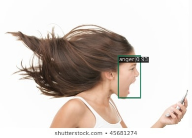
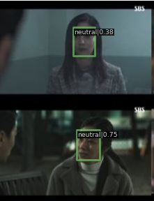

# Introduction
This repository is a repository for Nota assignment.
The dataset in this repository is solely used for Nota home assignment. Data should not be used for any other purpose.

This repository contains:
1. A guide for installation of requirements, training and inference.
2. Qualitative results.
3. Explanation (focused on problem definitions and modification on code).

The code highly depends on the opensource, MMdetection : [https://github.com/open-mmlab/mmdetection](https://github.com/open-mmlab/mmdetection)
MMDetection is an open source object detection toolbox based on PyTorch. It is a part of the [OpenMMLab](https://openmmlab.com/) project.

# A guide for installation of requirements, training and inference
## Overview
You can use [Google Colaboratory](https://colab.research.google.com/?utm_source=scs-index).
The overall script is [here](mmdetection.ipynb)

Simply following all the script will install the requirements, start training and inference on the test dataset.
Rest of the section is for script explanation and how to set custom configs.

## Installation
Please refer to [Installation](docs/en/get_started.md/#Installation) for installation instructions.
Follow the steps below according to the "Best Practices" section in the link above:

```
git clone https://github.com/wheemyungshin/mmdetection-nota-assignment.git
pip install -U openmim
mim install mmcv-full
pip install -v -e /content/mmdetection-nota-assignment
```

To fix [a bug during installation](https://github.com/open-mmlab/mmdetection/issues/8227), a new script line is added:
```
sed -i 's/if collection_name:/if collection_name and collection_name in name2collection\.keys():/g' /usr/local/lib/python3.7/dist-packages/mim/commands/search.py
```

## Dataset
The provided dataset contains 1,688 training set and 184 test set.
Annotation format is Pascal VOC and there is no label for test set.
The number of classes is 5.
Size is not uniform. There exists size under \~128 or over 1280\~.

After uploading the dataset onto the colab notebook, unzip the dataset.
```
mkdir data
mkdir data/facial_emotion_data
unzip [NOTA]facial_emotion_data.zip -d data/facial_emotion_data
python mmdetection-nota-assignment/converter.py
```

Before training, run "converter.py" to get the list of training set (trainval.txt).
```
python mmdetection-nota-assignment/converter.py
```

## Training
You can use ImageNet pretrained model from [model zoo](https://github.com/open-mmlab/mmdetection/blob/master/docs/en/model_zoo.md) provided by MMdetection.

For example, pretrained YOLOX model can be downloaded by the script below (Optional):
```
wget -O work_dirs/yolox_s_8x8_300e_nota/pretrain_yolox_s.pth https://download.openmmlab.com/mmdetection/v2.0/yolox/yolox_s_8x8_300e_coco/yolox_s_8x8_300e_coco_20211121_095711-4592a793.pth
```

The default model is RetinaNet with EfficientNet-B3.
The pretrained weight is automatically downloaded before training.
You can start training with the code below:
```
#python mmdetection-nota-assignment/tools/train.py \
    [config path] \
    [additional arguments]

python mmdetection-nota-assignment/tools/train.py \
    mmdetection-nota-assignment/configs/pascal_voc/retinanet_eff_fpn_1x_nota.py \
    --no-validate
```

Visualizae the results on test set:
```
python mmdetection-nota-assignment/demo/demo.py \
    mmdetection-nota-assignment/configs/pascal_voc/retinanet_eff_fpn_1x_nota.py \
    /content/work_dirs/retinanet_eff_fpn_1x_nota/epoch_12.pth \
    /content/data/facial_emotion_data/test/img \
    /content/work_dirs/retinanet_eff_fpn_1x_nota-test
```

You can zip the results for download:
```
zip retinanet_eff_fpn_1x_nota-test.zip -r /content/work_dirs/retinanet_eff_fpn_1x_nota-test
```

# Qualitative results
## Final results
* It shows good results.
<div align="center">
  
  
  
  
  
  
  <div>&nbsp;</div>
</div>

* However, there is also several error cases.
<div align="center">
  
  
  
  <div>&nbsp;</div>
</div>


## History results
* First results had overlapping boxes with different classes
<div align="center">
  
  
  
</div>

* The above problem is solved using class-agnostic NMS
<div align="center">
  
  
  
</div>

* Results with smaller model (RetinaNet with EfficientNet-B0) shows some undetected and misclassfied cases.
<div align="center">
  
  
  
  
  
  
  
  <div>&nbsp;</div>
</div>

# Explanation 
You can find my modifications on the source code [here](https://github.com/open-mmlab/mmdetection/compare/master...wheemyungshin:mmdetection-nota-assignment:master)

My contributions can be summarized as follows:
* Custom dataloader & data converter (converter.py , mmdet/datasets/voc.py/NOTADataset)
* RGB normalization for the custom data (configs/_base_/datasets/nota.py)
* NMS accross all classes (mmdet/models/detectors/single_stage.py, mmdet/core/post_processing/bbox_nms.py)
* More model selections (RetinaNet with EfficientNetB0&B3, YOLOX)
* Hyperparameter tuning (configs/pascal_voc/retinanet_r50_fpn_1x_nota.py , configs/pascal_voc/retinanet_eff_fpn_1x_nota.py , configs/yolox/yolox_s_8x8_300e_nota.py)

## Acknowledgement

MMDetection is an open source project that is contributed by researchers and engineers from various colleges and companies. We appreciate all the contributors who implement their methods or add new features, as well as users who give valuable feedbacks.
We wish that the toolbox and benchmark could serve the growing research community by providing a flexible toolkit to reimplement existing methods and develop their own new detectors.

## Citation

If you use this toolbox or benchmark in your research, please cite this project.

```
@article{mmdetection,
  title   = {{MMDetection}: Open MMLab Detection Toolbox and Benchmark},
  author  = {Chen, Kai and Wang, Jiaqi and Pang, Jiangmiao and Cao, Yuhang and
             Xiong, Yu and Li, Xiaoxiao and Sun, Shuyang and Feng, Wansen and
             Liu, Ziwei and Xu, Jiarui and Zhang, Zheng and Cheng, Dazhi and
             Zhu, Chenchen and Cheng, Tianheng and Zhao, Qijie and Li, Buyu and
             Lu, Xin and Zhu, Rui and Wu, Yue and Dai, Jifeng and Wang, Jingdong
             and Shi, Jianping and Ouyang, Wanli and Loy, Chen Change and Lin, Dahua},
  journal= {arXiv preprint arXiv:1906.07155},
  year={2019}
}
```

## License

This project is released under the [Apache 2.0 license](LICENSE).